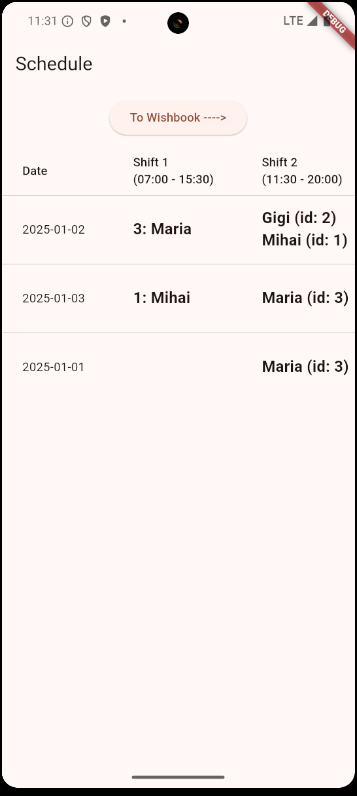
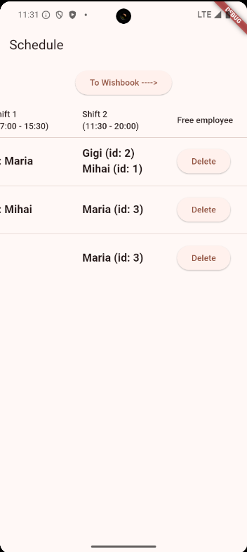
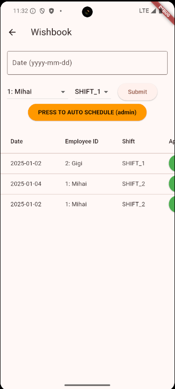
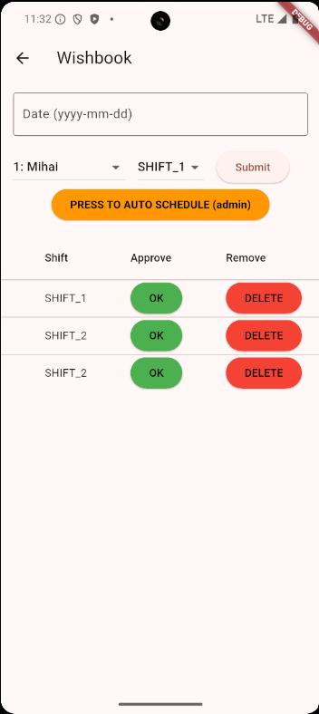

# Checkout Planner
Checkout Planner is a backend-based project designed to help store managers efficiently plan and organize work schedules for their stores. It streamlines the process by allowing employees to submit their availability for shifts, making it easier to create balanced and conflict-free schedules.

## **Key features:**
- Store managers can create and manage work schedules.
- Employees can input their availability for upcoming shifts.
- The system helps match employee availability with staffing needs.

## **Tech Stack**

- **Language:** Java  
- **Framework:** Spring Boot  
- **Database:** H2 (data stored locally in files)

## **Main Entities**

The project has **three main entities**:

- **Employee**  
  Not directly accessible from the app. After the hiring paperwork is completed, the employee is automatically added to the system.

- **Wishbook**  
  Accessible by both **Employees** and **Managers**. They can select their preferred working times for the employee.

- **Schedule**  
  Visible to everyone, but can be modified only by the **Admin**.

## Important calls

Employee
- GET http://localhost:8080/employees -> for getting all the employees

Wishbook
- GET http://localhost:8080/wishbook -> all preferred working times submitted by employees
- POST http://localhost:8080/wishbook -> employee to select his preferred working time
- DELETE http://localhost:8080/wishbook/{id} (Admin) can delete a wishbook

Schedule
- GET http://localhost:8080/schedule -> get the schedule
- POST http://localhost:8080/schedule/planning -> (Admin) it is used to approve wishbooks and set the schedule accordingly
- POST http://localhost:8080/schedule/planning/auto/{date} -> (Admin) it is used to automatically approve wishbooks and set the schedule accordingly for a specific day
- DELETE http://localhost:8080/schedule/planning/$date (Admin) can delete a schedule

## Frontend

To demonstrate the REST APIs, we use a Flutter application with two basic screens.

The first screen displays the completed schedule, including the date and the employees assigned to different shifts.

  
  

On the second screen, we can see the employees' wishbook, where the manager can approve or deny their requests. In addition, the manager can automatically schedule an employee for a specific day by simply pressing *PRESS TO AUTO SCHEDULE*.

  
  

## How to run 

1) Install JAVA (21+ SDK)
2) Instal Maven
3) Have a functional Flutter environment
4) Open a terminal on *cd ~/../checkoutplanner*
    - run `mvn spring-boot:run` (to "start the DB")
5) Open a terminal on *cd ~/../checkoutplanner/frontend*
    - run `flutter run` (to open the mobile app) 

### Observation

This is a test app; all data is stored internally and the database runs locally. Therefore, if you try to connect to the database from a physical device, it is possible that the IP address for the localhost will be different. In that case, you need to go to *~/../checkoutplanner/frontend/lib/service/api_service.dart* and modify the `baseUrl` to match your local machine’s IP address.
